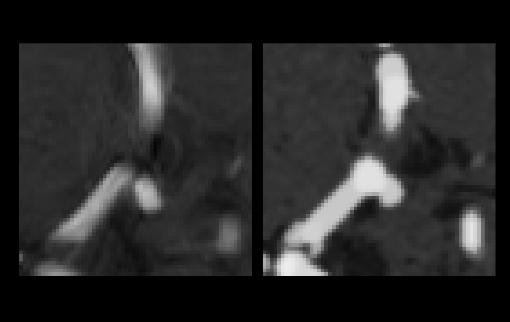
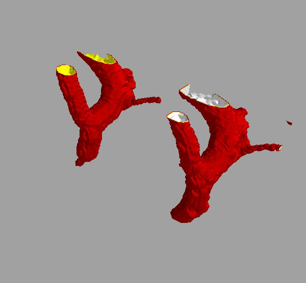
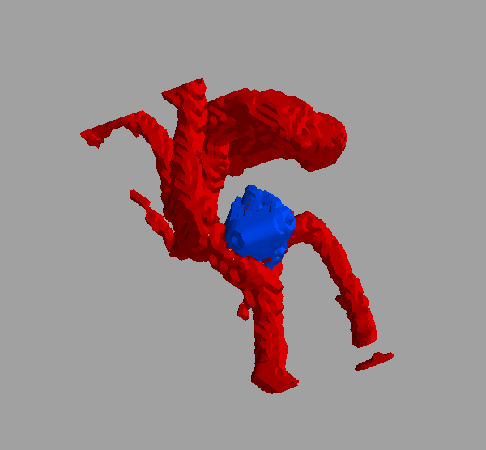

# VaMos

Vasculature Models (cerebral vascular tree modeling to feed a CNN  for its training phase)

## Description

VaMos proposes three different models :

- "model_bifurcation_fid.py"  --> models a given bifurcation (along with it's surrounding area)
- "model_rand_point_skel.py"  --> models a portion of the image (randomly looks for a 3D patch along the skeleton)
- "model_add_ICA.py"          --> models a given bifurcation and adds up an Intra-Cranial Aneurysm

## Visuals

<!---

-->

<!---

-->

  

    
  

  

    
  

  

    
  

## Requirements

The following python packages should be installed :

- scikit-image
- opencv-python
- sknw
- networkx
- numba
- scipy
- mayavi
- SimpleITK
- raster_geometry
- kimimaro
- napari
- matplotlib
- wxpython
- pynrrd
- pydicom
- pandas
- openpyxl

## Usage

`python model_bifurcation_fid.py -i <image.nrrd> -seg <image.seg.nrrd> -str <strSpl> -bn <BifNum> -fid <ID> -cs <CropSize>`

`python model_rand_point_skel.py -i <image.mha> -seg <segmentation.mha> -str <strSpl> -cs <CropSize>`

`python model_add_ICA.py -i <image.nrrd> -seg <image.seg.nrrd> -str <strSpl> -bn <BifNum> -fid <ID> -cs <CropSize> -r <Radius> -Sed <StdDev>`

## Authors and acknowledgment
<------>

## License
"CEA CNRS INRIA logiciel libre" CeCILL version 2.1

